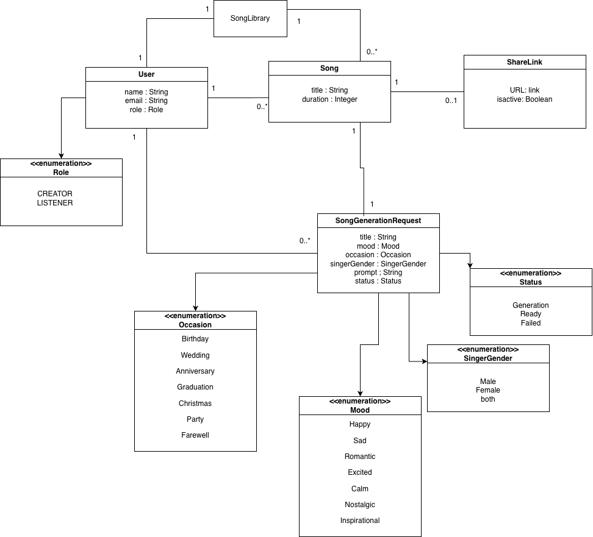

# Cithara

AI music generation web app built with Django and React. Users can create songs from prompts, manage a personal library, organize playlists, and share tracks through a simple web interface.


## Overview

Cithara is a full-stack project with:

- `Django` as the backend API and authentication layer
- `React + Vite` as the frontend
- `SQLite` for local development
- `django-allauth` for Google sign-in support
- A pluggable song generation flow with `mock` and `suno` strategies

The project is designed around a small music domain:

- `SongGenerationRequest` stores prompt, mood, occasion, and singer settings
- `GenerationJob` tracks generation status and returned audio URL
- `Song` stores the generated result
- `SongLibrary` groups a user's songs
- `Playlist` lets users organize songs into collections
- `ShareLink` exists in the domain model for shareable access

## Features

- Register and login with username/password
- Google login via `django-allauth`
- Generate songs from structured prompts
- Upload custom cover images
- Save songs into a personal library
- Create playlists and add/remove songs
- Copy share links for songs
- Download generated audio
- Switch generation backend between `mock` and `suno`

## Screenshots

| Page | Preview |
| --- | --- |
| Domain / UML |  |
| CRUD / Admin |  |

## Tech Stack

### Backend

- Python 3
- Django 6
- django-allauth
- django-cors-headers
- python-dotenv
- requests
- Pillow
- SQLite

### Frontend

- React
- Vite
- Axios
- React Router
- React Icons

## Project Structure

```text
cithara/
├── cithara/               # Django project settings
├── songs/                 # Main backend app
│   ├── generation/        # Mock and Suno generation strategies
│   ├── models/            # Domain models
│   ├── views.py           # API endpoints
│   └── urls.py
├── frontend/              # React + Vite frontend
│   └── src/
│       ├── components/
│       ├── context/
│       ├── pages/
│       └── styles/
├── db.sqlite3
├── manage.py
└── README.md
```

## Local Setup

### 1. Clone the repository

```bash
git clone <your-repo-url>
cd cithara
```

### 2. Create a virtual environment

```bash
python3 -m venv .venv
source .venv/bin/activate
```

### 3. Install backend dependencies

```bash
pip install django django-allauth django-cors-headers python-dotenv requests pillow
```

### 4. Configure environment variables

Create a `.env` file in the project root:

```env
GENERATOR_STRATEGY=mock
SUNO_API_KEY=your_suno_api_key
```

`GENERATOR_STRATEGY` options:

- `mock` for local demo mode
- `suno` to call the Suno API

### 5. Run database migrations

```bash
python3 manage.py migrate
```

### 6. Install frontend dependencies

```bash
cd frontend
npm install
cd ..
```

### 7. Start the backend

```bash
python3 manage.py runserver
```

Backend runs at `http://127.0.0.1:8000`

### 8. Start the frontend

In another terminal:

```bash
cd frontend
npm run dev
```

Frontend runs at `http://localhost:5173` or `http://127.0.0.1:5173`

## Authentication

### Username / Password

The app supports local registration and login from the frontend landing page.

### Google Login

Google sign-in is wired through `django-allauth`. To make it work locally, you need:

1. A Google OAuth client
2. A configured `SocialApp` entry in Django admin
3. The correct callback URL in Google Cloud Console

Typical local callback URL:

```text
http://127.0.0.1:8000/accounts/google/login/callback/
```

You also need to ensure the Django `Site` and the Google `SocialApp` are linked correctly.

## Song Generation Modes

### Mock Mode

`mock` mode returns a local sample audio file immediately. This is useful for UI development and demos.

### Suno Mode

`suno` mode sends generation requests to the Suno API and polls for status updates until audio becomes available.

## Main Pages

- `/` login and register page
- `/generate` create a new song
- `/library` browse generated songs
- `/playlists` manage playlists
- `/playlists/:id` playlist details and playback
- `/share/:id` open a shared song page
- `/admin` Django admin panel

## Example Development Workflow

```bash
python3 manage.py migrate
python3 manage.py runserver
cd frontend
npm install
npm run dev
```

Then open:

- Frontend: `http://127.0.0.1:5173`
- Backend: `http://127.0.0.1:8000`
- Admin: `http://127.0.0.1:8000/admin`

## Admin

Create an admin account with:

```bash
python3 manage.py createsuperuser
```

Use Django admin to inspect users, songs, generation requests, jobs, and related data.

## Notes

- The default local database is `SQLite`
- Media files are served from `cithara/media/` in development
- CORS is configured for the Vite frontend during local development
- If you use Google login, make sure frontend and backend hosts match your OAuth setup

## Future Improvements

- Add a `requirements.txt` or `pyproject.toml`
- Add automated tests for auth and generation flows
- Improve shared-song access rules
- Add deployment instructions for production

## License

This project is for educational and development use unless you define a separate license for distribution.
